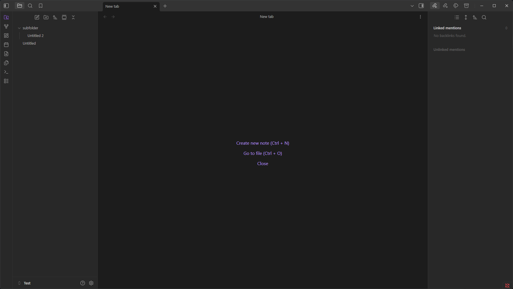
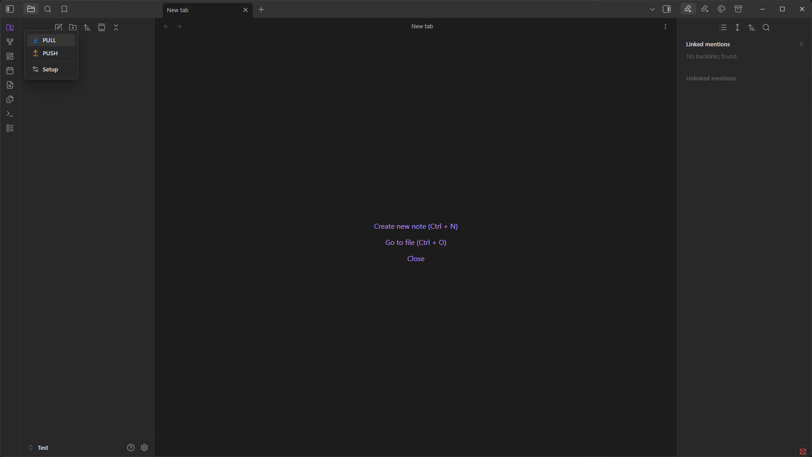
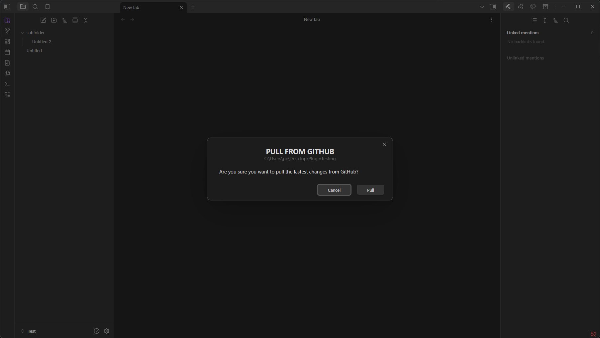
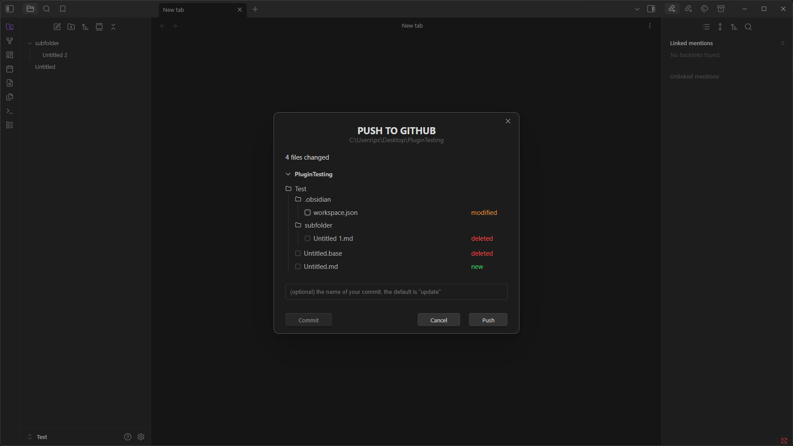
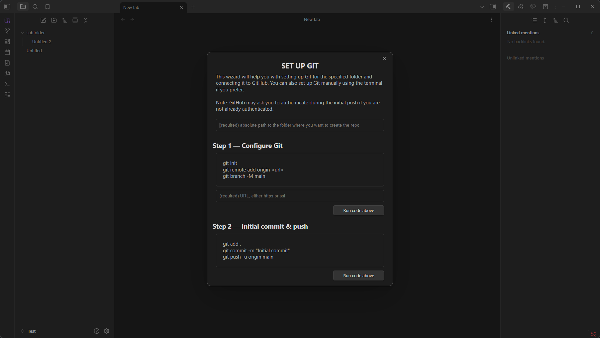

# Transparent GitHub Sync

This plugin was made mainly for personal use, but anyone is free to use it.

## Features

- It uses only the `main` branch for simplicity.
- Looks for the nearest `.git` directory up the folder tree, allowing you to use a single Git repository with one or multiple Obsidian vaults.
- Lets you select which files should be committed and pushed to GitHub through a simple UI.
  > Note: Pull and push operations aren't automatic. You manually control when they happen.

## Photos

It adds a ribbon icon in the accent color.

Clicking on the icon opens this menu.

Pull modal

Push modal

Setup wizard

## License

This plugin is licensed under the MIT License.
